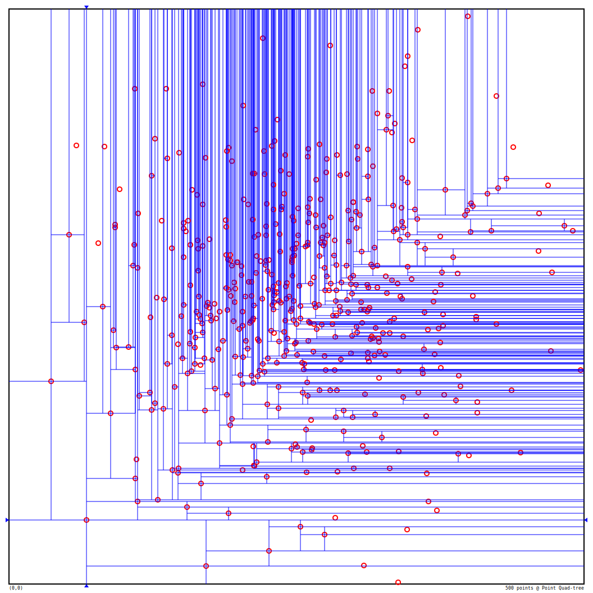

# QuadSQL

A Quad-tree index implementation for high-dimensional spatial databases. Both Point and Regian Quad-trees are implemented.

The following figures are exported from the interactive shell. These represent the Point and Region Quad-tree indexes on the same normally distributed dataset (500 points) with different insertion orders.

|              Point Quad-tree, Random               |               Region Quad-tree, Random               |
| :------------------------------------------------: | :--------------------------------------------------: |
|  |  |

|              Point Quad-tree, Sorted               |               Region Quad-tree, Sorted               |
| :------------------------------------------------: | :--------------------------------------------------: |
|  |  |

## Build

Ensure you have Go installed, the build was tested using Go 1.16. Simply run the following

```shell
$ go mod tidy
$ go build
```

## Usage

QuadSQL will open an interactive shell when launched. This shell has limited SQL-like query support.

QuadSQL uses a file-based storage for its data source. It must be provided when starting the shell.

```shell
$ ./quadsql --db data.db
```

This will build a Point Quad-Tree index in-memory automatically, to disable this behavior, use the flag `--no-index`. Use `--region` to force building a Region Quad-tree on launch instead. Index can be rebuilt and switched between the two types via the interactive shell.

### Generating Dataset

The following subcommand allows generation of the spatial dataset with various supported distributions.

```shell
$ ./quadsql generate 2 1000000 normal false --db data.db
```

This particular example will create a dataset on `data.db` with 1 million points normally distributed in a 2D space without ordering.
